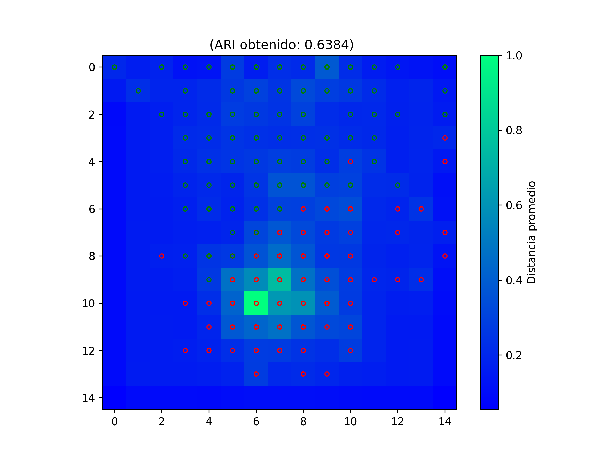

# Clustering de Datos de Cáncer de Mama mediante Self-Organizing Maps (SOM)

## Descripción

Este proyecto explora el uso de **Self-Organizing Maps (SOM)**, una red neuronal no supervisada propuesta por Teuvo Kohonen, para el análisis y agrupamiento de datos del conjunto **Breast Cancer Wisconsin Dataset**.

Los SOM permiten proyectar datos de alta dimensión sobre una representación bidimensional preservando, en la medida de lo posible, las relaciones de vecindad presentes en el espacio original. Esta propiedad los convierte en una herramienta útil para tareas de visualización, exploración de datos y agrupamiento no supervisado.

Con el objetivo de evaluar la calidad de los grupos obtenidos, se aplicó posteriormente el algoritmo **K-Means** sobre los pesos aprendidos por el mapa autoorganizado y se compararon las agrupaciones resultantes con las etiquetas reales del conjunto de datos mediante el índice **Adjusted Rand Index (ARI)**.

---

## Objetivos

- Implementar un Self-Organizing Map utilizando la biblioteca MiniSom.
- Analizar la capacidad de los SOM para identificar patrones en datos biomédicos.
- Explorar el efecto de distintos hiperparámetros sobre la organización del mapa.
- Evaluar cuantitativamente la calidad de los agrupamientos obtenidos mediante el índice ARI.
- Visualizar la estructura topológica aprendida por el modelo mediante una U-Matrix.

---

## Dataset

Se utilizó el **Breast Cancer Wisconsin Dataset**, disponible en Scikit-Learn.

El conjunto de datos contiene características calculadas a partir de imágenes digitalizadas de biopsias de mama y tiene como objetivo distinguir entre tumores benignos y malignos.

Características del dataset:

- 569 muestras.
- 30 variables numéricas.
- 2 clases diagnósticas (benigno y maligno).

---

## Metodología

### 1. Preprocesamiento

Antes del entrenamiento, los datos fueron normalizados mediante `MinMaxScaler` para garantizar que todas las variables contribuyeran de manera equilibrada al aprendizaje del mapa.

### 2. Entrenamiento del SOM

Se entrenó un mapa autoorganizado utilizando la biblioteca MiniSom con la siguiente configuración:

- Dimensiones del mapa: 15 × 15 neuronas.
- Radio de vecindad (sigma): 0.5.
- Tasa de aprendizaje (learning rate): 0.05.
- Inicialización de pesos mediante PCA.

Durante el entrenamiento, las neuronas ajustan sus pesos para representar la distribución de los datos y preservar relaciones de similitud entre observaciones.

### 3. Agrupamiento mediante K-Means

Una vez entrenado el SOM, se aplicó K-Means sobre los vectores de pesos aprendidos por las neuronas con el objetivo de obtener agrupamientos explícitos.

### 4. Evaluación

La calidad de los clusters obtenidos se evaluó mediante el **Adjusted Rand Index (ARI)**, métrica que compara las agrupaciones generadas con las etiquetas reales del conjunto de datos.

### 5. Visualización

Para interpretar la organización del mapa se generó una **U-Matrix (Unified Distance Matrix)**, herramienta clásica para identificar regiones densas y fronteras entre clusters dentro de un SOM.

---

## Resultados

El modelo evaluado con las configuraciones antes mencionadas obtuvo:

- **Adjusted Rand Index (ARI): 0.6384**

### U-Matrix obtenida

El mapa muestra la organización topológica aprendida por el SOM y permite identificar regiones asociadas a diferentes grupos de observaciones.

---

## Análisis de Hiperparámetros

Además de la configuración mostrada anteriormente, se realizaron múltiples experimentos variando:

- Tasa de aprendizaje.
- Radio de vecindad (sigma).
- Altura del mapa.
- Anchura del mapa.

El objetivo fue analizar el efecto de estos parámetros sobre la calidad de las agrupaciones obtenidas y sobre la estructura topológica generada por el SOM.

Los resultados completos y el análisis comparativo pueden consultarse en:

[Reporte técnico](resultadosmini.pdf)

---

## Tecnologías Utilizadas

- Python
- MiniSom
- Scikit-Learn
- NumPy
- Matplotlib

---

## Aprendizajes

Durante este proyecto se aplicaron conceptos relacionados con:

- Aprendizaje no supervisado.
- Self-Organizing Maps (SOM).
- Clustering.
- Reducción y visualización de estructuras de alta dimensión.
- Evaluación de agrupamientos mediante métricas externas.
- Análisis de hiperparámetros en redes neuronales.

---

## Autor

Jairo Isaac Muñoz López

Estudiante de Licenciatura en Matemáticas Aplicadas.

GitHub: https://github.com/munlopezi-lab
